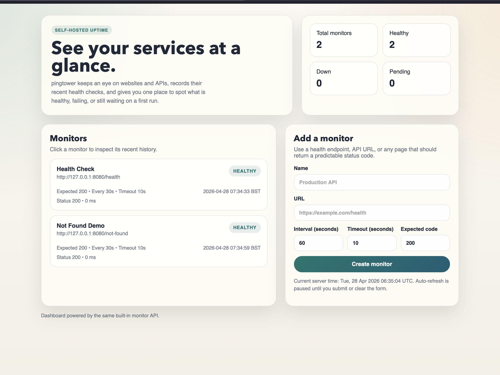
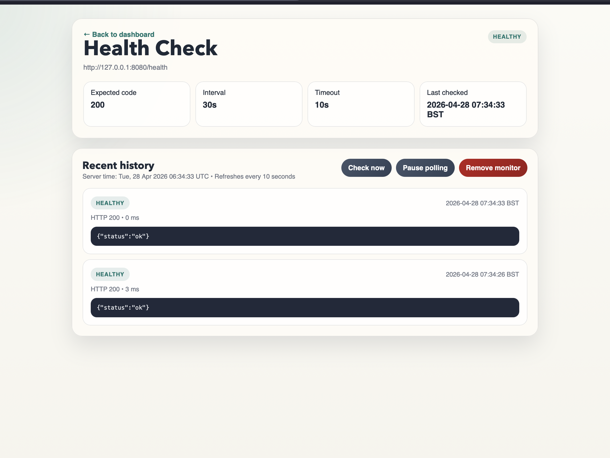

# pingtower

[](https://pkg.go.dev/github.com/crleonard/pingtower)
[](https://goreportcard.com/report/github.com/crleonard/pingtower)

`pingtower` is a lightweight self-hosted uptime monitor for websites and APIs. It runs as a small Go service, ships with a built-in web dashboard, and stores monitor state locally so you can get started quickly without extra infrastructure.



## Why Pingtower?

- Simple self-hosted monitoring for websites and APIs
- Lightweight setup with Go or Docker
- Built-in dashboard for status, history, pause, and remove actions
- JSON file-backed persistence for an easy day-1 developer experience
- Small codebase that is easy to read, extend, and learn from

## Features

- Monitor HTTP endpoints on a per-check interval
- Track recent status history for each monitor
- View monitor status and history in a browser dashboard
- Pause and resume polling per monitor
- Remove monitors you no longer need
- Configure expected status code and timeout
- Send custom request headers and Basic / Bearer auth on each poll
- Webhook alerts on status transitions
- Run locally with Go or in Docker

## Dashboard

Open [http://localhost:8080](http://localhost:8080) to:

- view all monitors and their current status
- add new monitors from a form
- inspect recent history for an individual monitor
- pause, resume, or remove a monitor from its detail page

The JSON API remains available for scripting and integrations.



## Installation

### Run locally

```bash
git clone https://github.com/crleonard/pingtower.git
cd pingtower
make run
```

Then open [http://localhost:8080](http://localhost:8080).

### Run with Docker Compose

```bash
git clone https://github.com/crleonard/pingtower.git
cd pingtower
docker compose up --build
```

## Configuration

| Variable | Default | Description |
| --- | --- | --- |
| `PINGTOWER_ADDR` | `:8080` | HTTP listen address |
| `PINGTOWER_DATA_FILE` | `data/pingtower.json` | Persistence path |
| `PINGTOWER_DEFAULT_INTERVAL` | `60s` | Default polling interval |
| `PINGTOWER_DEFAULT_TIMEOUT` | `10s` | Default request timeout |
| `PINGTOWER_MAX_HISTORY` | `100` | Max stored results per check |
| `PINGTOWER_USER_AGENT` | `pingtower/1.0` | User-Agent header for outbound checks |

Example:

```bash
export PINGTOWER_ADDR=":8080"
export PINGTOWER_DATA_FILE="data/pingtower.json"
export PINGTOWER_DEFAULT_INTERVAL="30s"
export PINGTOWER_DEFAULT_TIMEOUT="5s"
make run
```

## API

### Health check

```bash
curl http://localhost:8080/health
```

### Create a monitor

```bash
curl -X POST http://localhost:8080/checks \
  -H "Content-Type: application/json" \
  -d '{
    "name": "Example API",
    "url": "https://example.com/health",
    "interval_seconds": 60,
    "timeout_seconds": 10,
    "expected_status_code": 200
  }'
```

### Create a monitor with custom headers and a Bearer token

```bash
curl -X POST http://localhost:8080/checks \
  -H "Content-Type: application/json" \
  -d '{
    "name": "Authenticated API",
    "url": "https://api.example.com/me",
    "headers": {
      "X-API-Key": "abc123",
      "Accept": "application/json"
    },
    "auth_type": "bearer",
    "auth_value": "my-secret-token"
  }'
```

`auth_type` accepts `none`, `basic`, or `bearer`. For `basic`, `auth_value` is
the literal `user:pass` string (pingtower base64-encodes it on each request).

### List monitors

```bash
curl http://localhost:8080/checks
```

### Get a monitor

```bash
curl http://localhost:8080/checks/<check-id>
```

### Get monitor history

```bash
curl http://localhost:8080/checks/<check-id>/history
```

## Development

Run tests:

```bash
go test ./...
```

Build the binary:

```bash
go build -o dist/pingtower ./cmd/server
```

Or use:

```bash
make build
make test
```

## Storage

Pingtower currently uses JSON file-backed persistence. That keeps setup simple and makes the project easy to understand, but it is intended as a lightweight v1 storage layer rather than a long-term multi-user backend.

## Project Layout

```text
cmd/server           application entrypoint
internal/config      environment config
internal/httpapi     HTTP handlers and dashboard rendering
internal/model       shared data models
internal/monitor     background polling loop
internal/store       file-backed persistence
```

## Roadmap

- Improve live dashboard updates without full page refresh
- Move persistence to SQLite or Postgres
- Dashboard authentication

## Security note

Custom auth values (Basic credentials and Bearer tokens) are stored in the
data file in plain text. Restrict file permissions on `data/pingtower.json`
to trusted users, and consider running pingtower behind a reverse proxy or
on a private network rather than exposing the dashboard publicly — there is
no authentication on the dashboard yet.

## License

MIT. See [LICENSE](./LICENSE).
